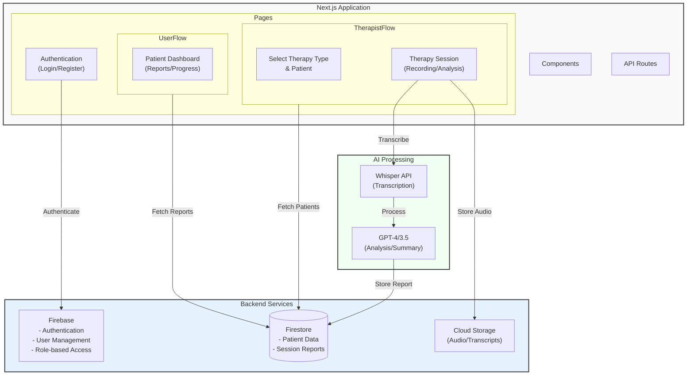

# recursive_video

# Recursive Video - Therapy Session Analysis Platform

A Next.js-based platform for automated therapy session recording and analysis.

## System Architecture



## Tech Stack

- **Framework**: Next.js 14 with App Router
- **Language**: TypeScript
- **Styling**: Tailwind CSS
- **Database**: Firebase/MongoDB
- **Authentication**: NextAuth.js
- **AI Processing**: OpenAI (Whisper + GPT-4)
- **Deployment**: Vercel

## Getting Started

1. Clone the repository:
```bash
git clone https://github.com/your-username/recursive_video.git
cd recursive-video
```

2. Install dependencies:
```bash
pnpm install
```

3. Create a `.env` file:
```env
NEXTAUTH_URL=http://localhost:3000
NEXTAUTH_SECRET=your-secret-here
OPENAI_API_KEY=your-key-here
DATABASE_URL=your-db-url
```

4. Run the development server:
```bash
pnpm dev
```

## Key Features

- Real-time audio recording and transcription
- AI-powered session analysis
- Interactive dashboard for therapists and parents
- Secure patient data management
- Progress tracking and reporting

## Project Structure

The project uses a feature-based structure within the Next.js App Router pattern:

- `app/`: Routes and API endpoints
- `components/`: Reusable UI components
- `lib/`: Shared utilities and services
- `types/`: TypeScript type definitions

## Development Workflow

1. Create a new branch for your feature
2. Implement changes following the project structure
3. Write tests for new features
4. Submit a pull request


## Team

- Francesco Crivelli
- Ben Yu
- Jay Jaisankar
- Raj Saravana
- Serena Mann

## License

MIT license
